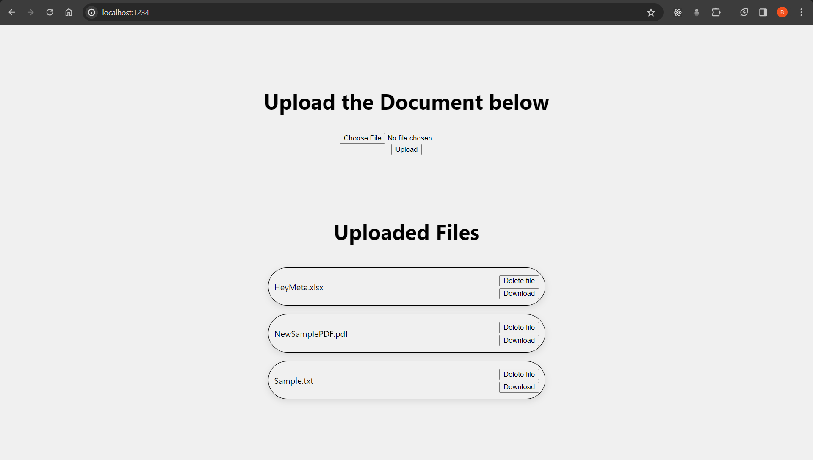

# File Management Application

This is a simple Node.js application for file management. It allows users to upload, delete, and download files from the server.

## Description

The application provides a web interface for users to perform various file management operations:

- **Upload:** Users can upload files to the server using the provided form.
- **List Files:** The application also displays a list of uploaded files on the main page, allowing users to see the files currently stored on the server.
- **Download:** Users can download uploaded files by clicking the "Download" button next to each file.
- **Delete:** Users can delete uploaded files by clicking the "Delete" button next to each file.

## Getting Started

1. Clone the repository to your local machine:.
   ```bash
   git clone https://github.com/rushikeshhirve/File-Management
2. Install dependencies with `npm install` or `npm i`.
   ```bash
   npm install

3. Run the application with `npm start`. Visit http://localhost:1234 in your browser.

## Modules Used

- **Express:** A web application framework for Node.js that simplifies the process of building robust web applications.
- **body-parser:** Middleware for handling HTTP POST requests, making it easier to extract data from the request body.
- **Multer:** A middleware for handling multipart/form-data, which is primarily used for uploading files in Node.js applications.

## Demo Screenshot


